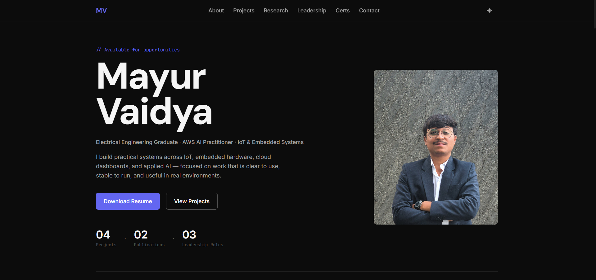
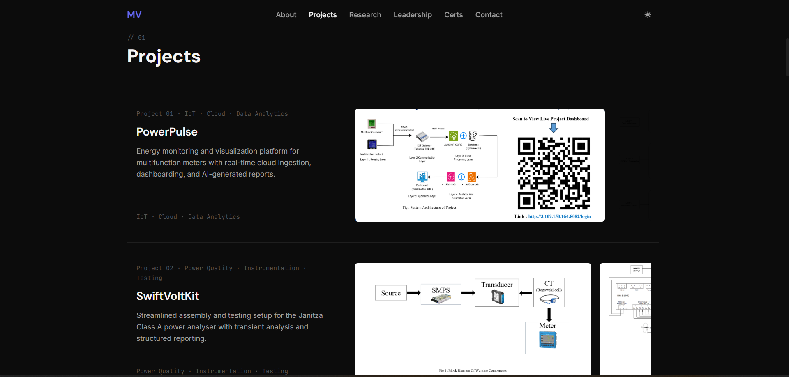
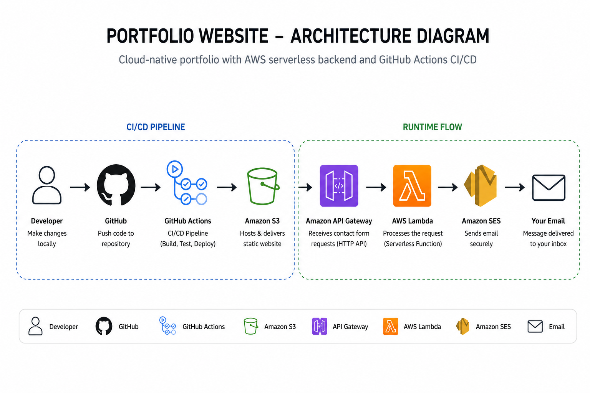
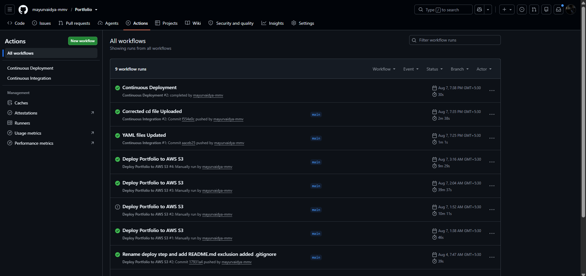
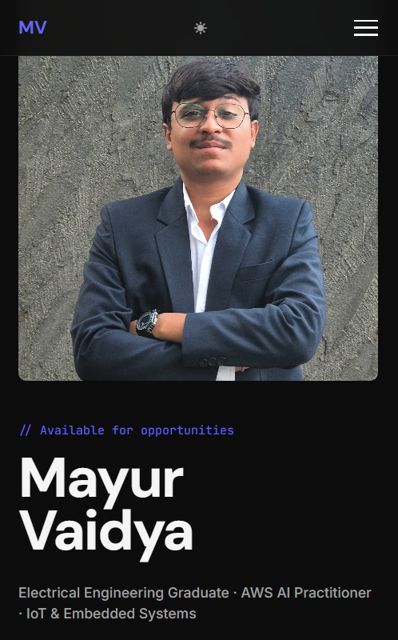

# 🌐 Portfolio Website

> A cloud-native personal portfolio showcasing my projects, certifications, technical experience, and achievements. Built with HTML, CSS, and JavaScript, deployed on Amazon S3, featuring a serverless contact system powered by Amazon API Gateway, AWS Lambda, and Amazon SES with an automated GitHub Actions CI/CD pipeline.

---

## 🏗️ System Architecture

---

## 🚀 Live Demo

> **Website:** *(http://mayurvaidya-portfolio.s3-website.ap-south-1.amazonaws.com/#hero)*

---

## 📖 Overview

This repository contains the source code for my personal portfolio website. It serves as a central place to showcase my technical projects, research work, certifications, leadership experience, and achievements.

The portfolio is hosted on **Amazon S3** and uses a **serverless backend** for its contact form. Visitors can send messages directly through the website without using an email client. Messages are securely processed using **Amazon API Gateway**, **AWS Lambda**, and **Amazon SES**.

To streamline development, the project uses **GitHub Actions** for Continuous Integration (CI) and Continuous Deployment (CD), automatically validating the project and deploying updates to AWS after successful integration.

---

## ✨ Features

### 🌐 Frontend
- Responsive and modern portfolio website
- Smooth animations and interactive UI
- Mobile-friendly design
- Dedicated sections for projects, certifications, achievements, and leadership

### ☁️ Cloud Infrastructure
- Static website hosted on **Amazon S3**
- Serverless backend using **AWS Lambda**
- RESTful **HTTP API** built with **Amazon API Gateway**
- Secure email delivery using **Amazon SES**

### ⚙️ DevOps & Automation
- Continuous Integration (CI) using **GitHub Actions**
- Continuous Deployment (CD) using **GitHub Actions**
- Automated deployment to Amazon S3 after successful Continuous Integration validation
- AWS credentials managed securely using GitHub Secrets

### 📬 Contact System
- Secure contact form
- JSON-based communication between frontend and backend
- Real-time email delivery to the portfolio owner
- No third-party form services required

---

## 🛠️ Technology Stack

| Category | Technology | Purpose |
|----------|------------|---------|
| **Frontend** | HTML5, CSS3, JavaScript (ES6) | Responsive user interface and client-side functionality |
| **Cloud Hosting** | Amazon S3 | Static website hosting |
| **Backend** | AWS Lambda (Python) | Serverless backend for processing contact form requests |
| **API** | Amazon API Gateway (HTTP API) | RESTful endpoint connecting frontend to Lambda |
| **Email Service** | Amazon SES | Secure email delivery from contact form |
| **DevOps** | GitHub Actions | Continuous Integration & Continuous Deployment (CI/CD) |
| **Version Control** | Git & GitHub | Source code management and collaboration |
| **Authentication** | GitHub Secrets | Secure storage of AWS credentials |
| **Deployment** | AWS CLI (`aws s3 sync`) | Automated deployment of website to Amazon S3 |

---

---

# 📸 Project Preview

## 🏠 Home Page

---

## 💼 Projects

---

## 📬 Contact Form

---

## ☁️ AWS Architecture

---

## ⚙️ CI/CD Pipeline

---

## 📱 Mobile Responsive View

---

# Portfolio Website

s